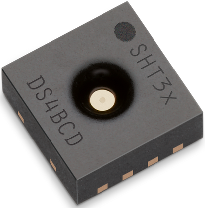

# ESP32 SHT3x Library
Implementation of the Sensirion SHT3x temperature and relative humidity sensor. It enables developers to communicate with the SHT3x sensor on the ESP32 platform by only adapting the I2C communication channel.

[<center></center>](images/SHT3x.png)

## Config
### Select Features
Edit the [`sht3x.h`](sht3x.h) header to select the GPIO used for the I2C interface.
```
#define I2C_MASTER_SDA      (GPIO_NUM_4)
#define I2C_MASTER_SCL      (GPIO_NUM_5)
```

#### Example
The [`main.c`](main.c) file is an example of how you could use the SHT3x sensor family with an ESP32 microcontroller.

Configure the I2C interface by setting the SDA and SCL GPIO, as well as buffer size and other optional settings.

```
i2c_config_t i2c_config = {
    .mode = I2C_MODE_MASTER,
    .sda_io_num = I2C_MASTER_SDA,
    .sda_pullup_en = GPIO_PULLUP_ENABLE,
    .scl_io_num = I2C_MASTER_SCL,
    .scl_pullup_en = GPIO_PULLUP_ENABLE,
    .master.clk_speed = I2C_MASTER_FREQ_HZ
};

ESP_ERROR_CHECK(i2c_param_config(I2C_MASTER_NUM, &i2c_config));
ESP_ERROR_CHECK(i2c_driver_install(I2C_MASTER_NUM, i2c_config.mode, I2C_MASTER_RX_BUF_DISABLE, I2C_MASTER_TX_BUF_DISABLE, 0));
```

The typical communication sequence between the I2C master (e.g., an ESP32 microcontroller) and the SHT3x sensor is as follows:
1. The sensor is powered up
2. The I2C master sends a start_periodic_measurement command. Signal update interval is 5 seconds.
3. The I2C master periodically reads out data with the read measurement sequence.
4. To put the sensor back to idle mode, the I2C master sends a stop periodic measurement command.

```
sht3x_start_periodic_measurement();

sht3x_sensors_values_t sensors_values = {
    .temperature = 0x00,
    .humidity = 0x00
};

if(sht3x_read_measurement(&sensors_values) != ESP_OK) {
    ESP_LOGE(SENSORS_TAG, "Sensors read measurement error!");
}

float temperature = sensors_values.temperature;
float humidity = sensors_values.humidity;

sht3x_stop_periodic_measurement();
```
